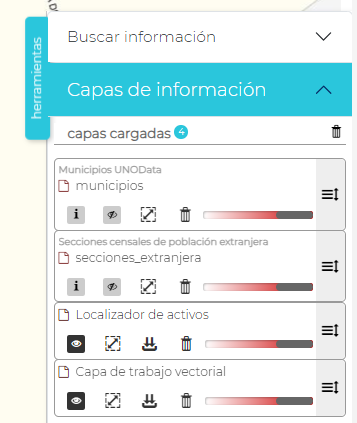
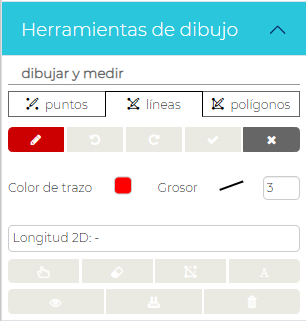

UNOVida es la aplicación de la Plataforma para la visualización y consulta de los servicios geográficos abiertos disponibles a través de la Plataforma

De forma genérica las aplicaciones UNOVida constan de los siguientes apartados:

- **Área de visualización**. Espacio de visualización geográfica de los datos de la aplicación
- **Herramientas de visualización** (Barra lateral izquierda). Opciones de visualización como gestión del zoom, vista inicial, acceso a Street View, geoposicionamiento e informes
- **Leyenda**. Imagen con las leyendas gráficas de las capas del visor
- **Mapa guía** con la caja geográfica dinámica de representación del área del visor
- **Panel de herramientas**. Acceso a las herramientas configuradas para la aplicación.

## Área de visualización
El usuario puede desplazarse y hacer zoom sobre el mapa usando el ratón.

Haciendo clic sobre el área de visualización se mostrarán las coordenadas del punto según el sistema de referencia (SRC) del mapa.

La gestión del sistema de coordenadas cuenta con su propia herramienta

## Herramientas de visualización
- Gestión del zoom
- Vista inicial
- Acceso a Street View,
- Geoposicionamiento
- Informes de servicios UNOData

## Panel de Herramientas
#### *Búsqueda de información*

Por coordenadas

Por nombres geográficos (Nominatim). Panel de filtro

Por nombres geográficos (Nominatim). Panel de resultados

#### *Capas de información*

Gestión de capas cargadas en la aplicación

Las opciones para capa son:

- Consulta de la descripción de la capa
- Control de visualización
- Zoom a la extensión de la capa
- Eliminar del área de visualización
- Gestión de transparencia
- Orden de visualización

#### *Consulta de atributos de las capas*

Haciendo clic sobre los elementos de las capas visibles se abrirá una ventana emergente con la información de los atributos de todas las capas.

Desde el formulario emergentes es posible también:

- Imprimir los atributos
- Mostrar en el mapa todos los resultados
- Centrar mapa en los resultados
- Borrar la selección
- Descarga la geometría en varios formatos SIG

####
#### *Mapas base*
Gestiona el cambio del mapa base del área de visualización.

#### *Herramientas UNOData*

Acceso a las herramientas de consulta de los distintos servicios de datos de la Plataforma.

- Información de Afecciones

- Información de Catastro

- Visualizar series históricas

Acceso al conjunto de mapas base y ortografías de series históricas.

#### *Consultas*

Por referencia catastral

#### *Añadir información al sistema*

Desde la aplicación pueden ser añadidas recursos externos como servicios WMS y añadir archivos locales en distintos formatos SIG

Los formatos de archivos permitidos son KML, KMZ, GML, GeoJSON, TopoJSON, WKT, WKB, Shapefile o GeoPackage
#### *Catálogo de servicios*

#### *Herramientas de dibujo*

