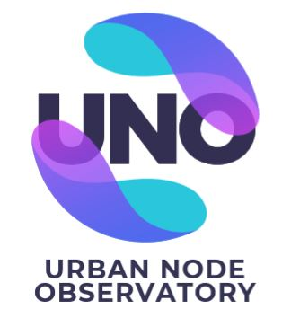

# Introducción a la Plataforma UNOData

**UNOData** es una Plataforma basada en la innovación tecnológica de la Ciencia de Datos, que facilita a las organizaciones tener la información organizada para la mejora de la gestión internar y la toma decisiones más acertadas.

Las acciones de la Plataforma trabajan en cuatro niveles claramente diferenciados. ​

- Ver y reconocer​
- Interactuar y aportar​
- Integrar y colaborar​
- Análisis e inteligencia territorial ​

## Visualiza y consulta

- Visualizador personalizado de capas de las Infraestructura de Datos Espaciales
- Visualizador capas de información propia
- Consultas sobre afecciones y normas de aplicación​
- Consultas para localización de parcelas según condicionantes​
- Consulta centralizada/informes​

## Interactúa.​

## Integraciones con terceros

##  Aplicaciones de alto valor añadido

