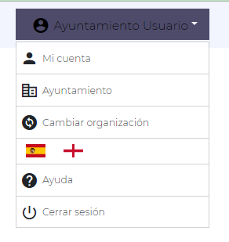

Haciendo clic en el nombre del usuario (Barra superior derecha) la aplicación mostrará distintas opciones vinculadas con el perfil del usuario.

### Mi perfil

Dará acceso a los datos del perfil de usuario permitiendo la consulta y actualización de los mismos.

### Mi Organización

Datos sobre la Organización en la que se encuentra el usuario.

### Cambiar Organización

En el caso de que el usuario pertenezca a varias organizaciones, el menú da la opción de volver al panel de organizaciones y cambiarla.

### Idioma

Cambio de idioma de la Platafoma.

## Ayuda

Acceso a la web de documentación oficial de la Plataforma UNOData.

## Cerrar sesión

Cerra la sesión de la Plataforma.

